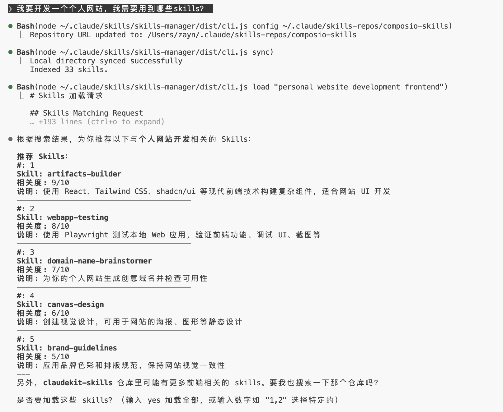

# Claude Skills Manager

[English](#english) | [中文](#中文)

---

<a name="english"></a>
## English

An intelligent Skills management system that runs as a **Claude Code Custom Skill**. It helps you sync, search, and load skills from remote repositories.

### Demo

> **Example**: Search for skills to help with "personal website development"
>
> Skills synced from [claudekit-skills](https://github.com/mrgoonie/claudekit-skills) and [awesome-claude-code](https://github.com/hesreallyhim/awesome-claude-code)



### Quick Start

#### Step 1: Install as Claude Code Skill

```bash
# Clone to Claude Code skills directory
git clone https://github.com/Azurboy/claude_skills_control.git ~/.claude/skills/skills-manager

# Enter directory and build
cd ~/.claude/skills/skills-manager
npm install
npm run build
```

#### Step 2: Configure Skills Repository

```bash
# Use a community skills repository (or your own)
node dist/cli.js config https://github.com/ComposioHQ/awesome-claude-skills

# Sync skills
node dist/cli.js sync
```

#### Step 3: Use in Claude Code

Now you can use it directly in Claude Code:

```
You: "Find me a skill about MCP Server development"

Claude will automatically:
1. Search through all synced skills
2. Recommend the most relevant ones
3. Load them after your confirmation
4. Use the skill content to help you
```

That's it! No changes needed to your own skills repository.

---

### Why Skills Manager?

#### The Problem

Imagine you have 100+ skills in your Claude Code:
- `react-hooks.md`
- `mcp-guide.md`
- `docker-deploy.md`
- `api-design.md`
- ... and 96 more

When you need help with "creating an MCP Server to connect external APIs", how do you find the right skill?

**Without Skills Manager:** Manually search through 100 files, trying to remember which one is relevant. Takes 10-20 minutes.

**With Skills Manager:** Just say "find me a skill about MCP Server" and get instant recommendations.

#### The Solution: Three-Tier Matching

```
Your query: "create MCP Server"
         ↓
┌─────────────────────────────────────────┐
│ Layer 1: Keyword Pre-filtering (Local)  │
│ - Extract keywords: [mcp, server]       │
│ - Match against name/description/tags   │
│ - Filter to top 20 candidates           │
└─────────────────────────────────────────┘
         ↓
┌─────────────────────────────────────────┐
│ Layer 2: LLM Selection (Smart)          │
│ - Send only 20 candidates (~1K tokens)  │
│ - LLM picks the 5 most relevant         │
└─────────────────────────────────────────┘
         ↓
┌─────────────────────────────────────────┐
│ Layer 3: User Confirmation + Load       │
└─────────────────────────────────────────┘
```

**Why three layers?**

| Approach | 100 skills | 500 skills | Problem |
|----------|-----------|-----------|---------|
| Send all to LLM | ~10K tokens | ~50K tokens | Context explosion, expensive |
| Pure keyword matching | Fast but imprecise | Fast but imprecise | Can't understand semantics |
| **Three-tier** | ~1K tokens | ~1K tokens | Fast + Accurate + Controllable |

---

### Features

- **Remote Repository Sync** - Clone and update skills from GitHub repositories
- **Three-Tier Matching** - Keyword pre-filtering + LLM selection + User confirmation
- **Usage Tracking** - Learn from feedback to improve future recommendations
- **Bilingual Support** - Works with both English and Chinese queries
- **Dynamic Loading** - Load skill content directly into your Claude Code session

---

### Commands Reference

| Command | Description |
|---------|-------------|
| `sync` | Sync skills from remote repository |
| `list` | List all available skills |
| `load <query>` | Search and find matching skills |
| `show <skill-id>` | View a specific skill |
| `inject <id> [id...]` | Load skills by ID |
| `config [repo-url]` | View or update configuration |
| `feedback <id> useful\|notuseful [scenario]` | Mark skill usefulness |
| `stats` | View usage statistics |

### Example: Search and Load

```bash
# Search for skills
node dist/cli.js load "create MCP Server"

# Output shows pre-filtered candidates:
# 1. [mcp-builder] - Guide for creating MCP servers...
# 2. [connect-apps] - Connect Claude to external apps...

# Load the skill you want
node dist/cli.js inject mcp-builder
```

### Example: Usage Feedback

```bash
# Mark as useful with scenario description
node dist/cli.js feedback mcp-builder useful "building API integration tools"

# Mark as not useful
node dist/cli.js feedback some-skill notuseful
```

---

### Supported Skills Repository Formats

#### Format 1: Standard (Recommended)

```
your-skills-repo/
├── skills/
│   ├── react-best-practices.md
│   ├── nodejs-api-design.md
│   └── docker-compose.md
└── README.md
```

#### Format 2: Composio Style

```
your-skills-repo/
├── mcp-builder/
│   └── SKILL.md
├── pdf-tools/
│   └── SKILL.md
└── README.md
```

#### Skill File Format

Each skill file should include frontmatter:

```markdown
---
name: React Best Practices
description: Best practices for React development
tags: [react, hooks, performance]
domain: frontend
scenario: development
level: intermediate
---

# React Best Practices

Your skill content here...
```

---

### Configuration

Configuration is stored in `~/.claude-skills-config.json`:

```json
{
  "repoUrl": "https://github.com/user/skills-repo",
  "cacheDir": "~/.claude-skills-cache",
  "autoSync": true
}
```

Usage data is stored in `~/.claude-skills-cache/usage.json`.

---

### Recommended Skills Repositories

- [ComposioHQ/awesome-claude-skills](https://github.com/ComposioHQ/awesome-claude-skills) - High-quality community skills
- [travisvn/awesome-claude-skills](https://github.com/travisvn/awesome-claude-skills) - Curated community skills

---

### FAQ

**Q: Do I need to modify my own skills repository?**

A: No. Skills Manager works with any skills repository that follows standard formats. Just point it to your repo URL.

**Q: Why do I need to run `npm install` and `npm run build`?**

A: The CLI is written in TypeScript and needs to be compiled. This is a one-time setup.

**Q: Can I use this without Claude Code?**

A: Yes, you can use it as a standalone CLI tool. Just run commands like `node dist/cli.js load "your query"`.

---

<a name="中文"></a>
## 中文

智能 Skills 管理系统，作为 **Claude Code Custom Skill** 运行，帮助你从远程仓库同步、搜索和加载 skills。

### 演示

> **示例**：搜索帮助"开发个人网站"的 skills
>
> Skills 来源：[claudekit-skills](https://github.com/mrgoonie/claudekit-skills) 和 [awesome-claude-code](https://github.com/hesreallyhim/awesome-claude-code)


### 快速开始

#### 第一步：安装为 Claude Code Skill

```bash
# 克隆到 Claude Code skills 目录
git clone https://github.com/Azurboy/claude_skills_control.git ~/.claude/skills/skills-manager

# 进入目录并构建
cd ~/.claude/skills/skills-manager
npm install
npm run build
```

#### 第二步：配置 Skills 仓库

```bash
# 使用社区 skills 仓库（或你自己的）
node dist/cli.js config https://github.com/ComposioHQ/awesome-claude-skills

# 同步 skills
node dist/cli.js sync
```

#### 第三步：在 Claude Code 中使用

现在可以直接在 Claude Code 中使用：

```
你: "帮我找一个关于 MCP Server 开发的 skill"

Claude 会自动：
1. 搜索所有已同步的 skills
2. 推荐最相关的几个
3. 在你确认后加载它们
4. 使用 skill 内容来帮助你
```

就这么简单！不需要修改你自己的 skills 仓库。

---

### 为什么需要 Skills Manager？

#### 问题

想象一下你的 Claude Code 里有 100+ 个 skills：
- `react-hooks.md`
- `mcp-guide.md`
- `docker-deploy.md`
- `api-design.md`
- ... 还有 96 个

当你需要"创建一个连接外部 API 的 MCP Server"时，怎么找到对应的 skill？

**没有 Skills Manager：** 手动翻找 100 个文件，努力回忆哪个是相关的。需要 10-20 分钟。

**有了 Skills Manager：** 只需说"帮我找一个关于 MCP Server 的 skill"，立即获得推荐。

#### 解决方案：三层匹配策略

```
你的查询: "创建 MCP Server"
         ↓
┌─────────────────────────────────────────┐
│ 第一层: 关键词预筛选 (本地)              │
│ - 提取关键词: [mcp, server]             │
│ - 匹配 name/description/tags           │
│ - 筛选出前 20 个候选                    │
└─────────────────────────────────────────┘
         ↓
┌─────────────────────────────────────────┐
│ 第二层: LLM 精选 (智能)                  │
│ - 只发送 20 个候选 (~1K tokens)         │
│ - LLM 选出最相关的 5 个                 │
└─────────────────────────────────────────┘
         ↓
┌─────────────────────────────────────────┐
│ 第三层: 用户确认 + 加载                  │
└─────────────────────────────────────────┘
```

**为什么需要三层？**

| 方案 | 100 skills | 500 skills | 问题 |
|------|-----------|-----------|------|
| 全部发给 LLM | ~10K tokens | ~50K tokens | 上下文爆炸，成本高 |
| 纯关键词匹配 | 快但不准 | 快但不准 | 无法理解语义 |
| **三层策略** | ~1K tokens | ~1K tokens | 快速 + 精准 + 可控 |

---

### 功能特性

- **远程仓库同步** - 从 GitHub 仓库克隆和更新 skills
- **三层匹配策略** - 关键词预筛选 + LLM 精选 + 用户确认
- **使用追踪** - 从反馈中学习，改进未来推荐
- **中英文支持** - 支持中英文混合查询
- **动态加载** - 将 skill 内容直接加载到 Claude Code 会话中

---

### 命令参考

| 命令 | 说明 |
|------|------|
| `sync` | 从远程仓库同步 skills |
| `list` | 列出所有可用 skills |
| `load <query>` | 搜索并查找匹配的 skills |
| `show <skill-id>` | 查看指定 skill |
| `inject <id> [id...]` | 按 ID 加载 skills |
| `config [repo-url]` | 查看或更新配置 |
| `feedback <id> useful\|notuseful [场景]` | 标记 skill 是否有用 |
| `stats` | 查看使用统计 |

### 示例：搜索并加载

```bash
# 搜索 skills
node dist/cli.js load "创建 MCP Server"

# 输出显示预筛选的候选：
# 1. [mcp-builder] - 创建 MCP 服务器的指南...
# 2. [connect-apps] - 连接 Claude 到外部应用...

# 加载你想要的 skill
node dist/cli.js inject mcp-builder
```

### 示例：使用反馈

```bash
# 标记为有用，并添加场景描述
node dist/cli.js feedback mcp-builder useful "构建 API 集成工具"

# 标记为无用
node dist/cli.js feedback some-skill notuseful
```

---

### 支持的 Skills 仓库格式

#### 格式 1：标准格式（推荐）

```
your-skills-repo/
├── skills/
│   ├── react-best-practices.md
│   ├── nodejs-api-design.md
│   └── docker-compose.md
└── README.md
```

#### 格式 2：Composio 风格

```
your-skills-repo/
├── mcp-builder/
│   └── SKILL.md
├── pdf-tools/
│   └── SKILL.md
└── README.md
```

#### Skill 文件格式

每个 skill 文件应包含 frontmatter：

```markdown
---
name: React Best Practices
description: React 开发最佳实践
tags: [react, hooks, performance]
domain: frontend
scenario: development
level: intermediate
---

# React Best Practices

Skill 内容...
```

---

### 配置

配置存储在 `~/.claude-skills-config.json`：

```json
{
  "repoUrl": "https://github.com/user/skills-repo",
  "cacheDir": "~/.claude-skills-cache",
  "autoSync": true
}
```

使用数据存储在 `~/.claude-skills-cache/usage.json`。

---

### 推荐的 Skills 仓库

- [ComposioHQ/awesome-claude-skills](https://github.com/ComposioHQ/awesome-claude-skills) - 高质量社区 skills
- [travisvn/awesome-claude-skills](https://github.com/travisvn/awesome-claude-skills) - 精选社区 skills

---

### 常见问题

**Q: 我需要修改自己的 skills 仓库吗？**

A: 不需要。Skills Manager 可以与任何遵循标准格式的 skills 仓库配合使用。只需指向你的仓库 URL 即可。

**Q: 为什么需要运行 `npm install` 和 `npm run build`？**

A: CLI 是用 TypeScript 编写的，需要编译。这是一次性设置。

**Q: 可以不在 Claude Code 中使用吗？**

A: 可以。你可以将它作为独立的 CLI 工具使用，直接运行 `node dist/cli.js load "你的查询"` 等命令。

---

## License

MIT
